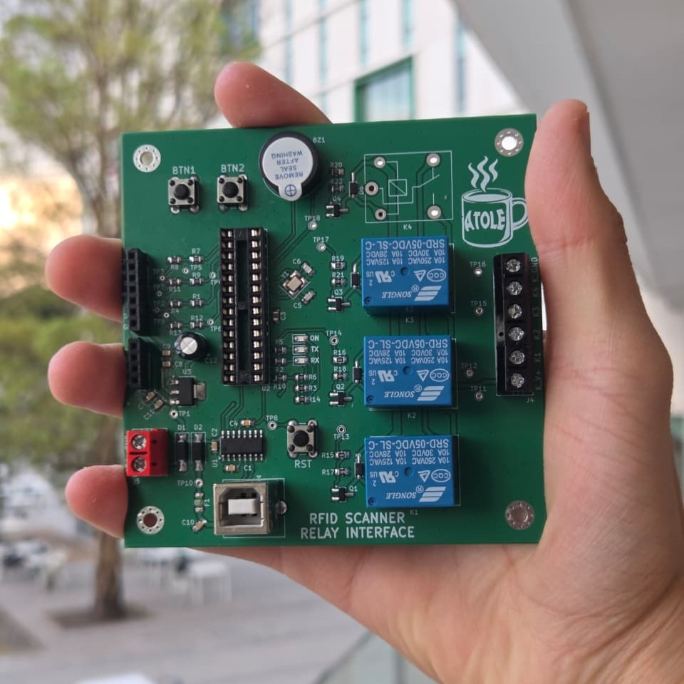

# 🏭 Team ATOLE Manufacturing Cell
### PLC Coordination · Computer Vision · Collaborative Robotics · IIoT Monitoring · Cybersecurity

An Industry 4.0 manufacturing cell developed at Tecnológico de Monterrey that integrates industrial automation, machine vision, collaborative robotics, Industrial IoT, cybersecurity, custom electronics, and digital manufacturing.

The system simulates an automated pastry production facility capable of:

- Identifying products using industrial vision
- Dynamically selecting manufacturing recipes
- Coordinating two Siemens PLCs through an S7 network
- Performing automated material handling with a collaborative robot
- Monitoring energy consumption in real time via MQTT
- Enforcing operator authentication through RFID access control
- Palletizing finished products automatically

---

# 📖 Project Overview

The project combines machining, industrial automation, robotics, cybersecurity, and Industrial IoT into a single integrated manufacturing system.

The complete solution is divided into two major subsystems:

## ⚙️ Plant 1 – Machining & Industrial IoT Monitoring

A custom Aluminum 6061 workpiece was designed, manufactured, and monitored during machining operations.

A custom non-invasive monitoring system measures:

- RMS current
- Active power
- Energy consumption
- Operating cost
- Machine operating state

The collected data is transmitted through MQTT and visualized in real time using a Node-RED dashboard.

---

## 🏭 Plant 2 – Automated Manufacturing Cell

The manufacturing cell is controlled by two Siemens S7-1200 PLCs interconnected through industrial Ethernet communication.

The production process includes:

1. Product classification using Cognex Vision
2. Automatic recipe selection
3. Pneumatic processing stations
4. Conveyor synchronization
5. Collaborative robotic manipulation
6. Product assembly
7. Automated palletizing

---

# 🏗️ System Architecture

The architecture integrates:

- Siemens S7-1200 PLCs
- Siemens HMIs
- Cognex Vision Sensor
- UFACTORY xArm Lite 6
- ESP32 IoT Gateway
- MQTT Broker
- Node-RED Dashboard
- RFID Authentication System
- Pneumatic Stations
- Conveyor Network

---

# 🎛️ Industrial Automation

The automation layer was implemented using two Siemens S7-1200 PLCs communicating through an S7 network.

Key features include:

- Dual PLC architecture
- Bidirectional communication
- Dynamic recipe management
- Conveyor synchronization
- Pneumatic sequencing
- HMI operation and diagnostics

---

# 👁️ Computer Vision

A Cognex industrial vision sensor acts as the cell’s quality gate.

Three reference objects are classified and mapped to production recipes:

| Object | Recipe |
|----------|----------|
| Turned Aluminum Part | Chocolate |
| Milled Aluminum Part | Strawberry |
| Metal Hook | Vanilla |

The detected classification is transmitted directly to the PLC network and automatically configures downstream process parameters.

---

# 🤖 Collaborative Robotics

A UFACTORY xArm Lite 6 collaborative robot performs:

- Raw material loading
- Inter-conveyor transfers
- Product assembly
- Palletizing

The robot was programmed in Python using the xArm SDK and operates through a Finite State Machine (FSM) architecture capable of managing multiple workpieces simultaneously.

---

# 📡 Industrial IoT Monitoring

A custom monitoring cabinet was developed around:

- ESP32
- SCT-013 Current Transformer
- ADS1115 16-bit ADC

The system continuously estimates:

- Current
- Power
- Energy
- Operating cost
- Machine utilization

without requiring direct electrical connection to the machine power circuit.

---

# 📊 MQTT & Node-RED Dashboard

Process variables are published through MQTT and visualized through a Node-RED dashboard.

Available metrics include:

- Live current consumption
- Active power
- Energy usage
- Estimated operating cost
- Machine operating state
- Historical trends

---

# 🔐 RFID Cybersecurity

An RFID authentication system was integrated to restrict access to critical HMI functions.

Only authorized operators are allowed to access or modify manufacturing parameters.

---

# 🔧 Custom Hardware Development

Several custom-designed hardware components were developed specifically for this project.

## 💻 IoT Monitoring PCB

Custom PCB for:

- Signal conditioning
- Current measurement
- ESP32 integration
- MQTT communication

---

# 🔧 Custom Hardware Development

Several custom electronic and mechanical systems were designed and fabricated specifically for this project.

## 🔐 RFID Access Control PCB

A custom PCB based on the ATmega328P was designed to provide RFID-based operator authentication.

Main features:

- ATmega328P microcontroller
- RFID card reader
- Relay outputs for PLC interfacing
- User identification system
- HMI access control

The board allows the PLC to identify authorized operators and restrict access to critical manufacturing functions.

  

---

## 📡 IoT Energy Monitoring System

A dedicated Industrial IoT monitoring system was developed to analyze the electrical consumption of the ROMI T240 lathe.

Hardware used:

- ESP32
- SCT-013 Current Transformer
- ADS1115 16-bit ADC
- Signal conditioning circuit

The system was implemented on a prototyping board and publishes real-time data through MQTT for remote monitoring and energy analysis.

---

## 🦾 Custom End Effectors

Custom grippers were designed and manufactured to handle:

- Raw materials
- Semi-finished products
- Finished assemblies
- Palletizing operations

---

# 🛠️ Manufacturing

## ⚙️ Custom Machined Component

A stepped Aluminum 6061 workpiece was designed in Fusion 360 and manufactured on a ROMI T240 lathe.

The part serves both as a manufactured component and as a reference object for the vision classification system.

| CAD Model | Manufactured Part |
|------------|------------|
|  |  |

---

# 🧰 Software & Engineering Tools

- Siemens TIA Portal
- Siemens Plant Simulation
- Python
- xArm SDK
- MQTT
- Mosquitto
- Node-RED
- Arduino IDE
- Fusion 360
- KiCad

---

# 📈 Results

The final system successfully demonstrated:

✅ Industrial machine vision integration

✅ Dual-PLC communication architecture

✅ Collaborative robotic manipulation

✅ Automated product assembly

✅ Automated palletizing

✅ MQTT-based Industrial IoT monitoring

✅ Real-time energy analytics

✅ RFID-based cybersecurity controls

✅ Custom electronics and PCB development

✅ End-to-end Industry 4.0 integration

---

# 👥 Team

**Team ATOLE**

Tecnológico de Monterrey, Campus Querétaro

B.S. in Mechatronics Engineering

- Kintia Alexa Negrete Osuna
- Francisco Hernández Ramírez
- Sebastián León Medellín
- Yudy Camila Pérez Cervantes
- Jesús Zamora Castelazo

---

# 📄 License

This project is licensed under the MIT License.
